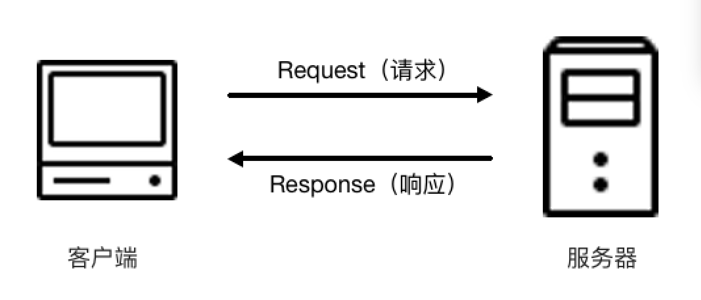
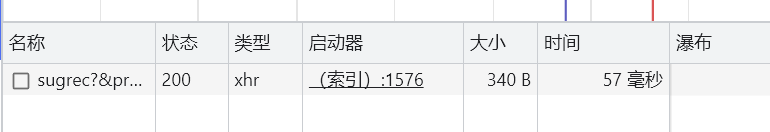
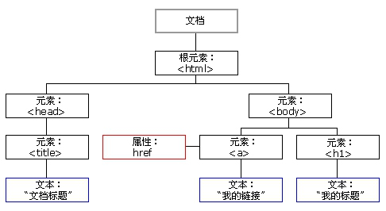
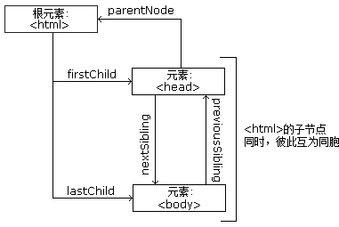

# HTTP 基本原理

## URI&URL

### URI

- 用于标识和定位资源的字符串序列
- 它是一种标准化的命名方式，用于唯一地标识一个资源，包括但不限于文件、网页、API 端点等
- URI 是一个广义的概念，包括两个子集：URL 和 URN。

### URL

- 是 URI 的一种常见形式。它是一种特定格式的字符串，用于描述一个资源的位置（或地址）
- 提供了一种标准的方式来访问网络上的资源，例如网页、图片、文件等
- 例子：`https://www.example.com/index.html?id=12345`
  - 协议是 HTTPS。
  - 主机名是 [www.example.com。](http://www.example.com./)
  - 路径是 /index.html。
  - 查询参数是 id=12345。

### 区别

- URI 和 URL 的区别在于 URI 是一个更广泛的概念，包含了所有用于标识和定位资源的方式。
- 而 URL 则是 URI 的一种具体实现形式。URL 提供了一种特定的语法和格式，用于指定资源的位置和访问方式

## 超文本

- 网页的源代码 HTML 就可以称作超文本

## HTTP 和 HTTPS

### 概念

- 协议类型

- HTTP：超文本传输协议
- HTTPS：HTTP 的安全版  ，HTTP 下加入 SSL 层

### HTTP请求过程

在浏览器中输入URL，回车之后浏览器向网站所在的服务器发送了一个请求，网站服务器接收到这个请求后进行处理和解析，然后返回对应的响应，接着传回给浏览器。响应里包含了页面的源代码等内容，浏览器再对其进行解析，便将网页呈现了出来

网络请求具体含义

* 第一列 Name：请求的名称，一般会将 URL 的最后一部分内容当作名称。
* 第二列 Status：响应的状态码，这里显示为 200，代表响应是正常的。通过状态码，我们可以判断发送了请求之后是否得到了正常的响应。
* 第三列 Type：请求的文档类型。这里为 xhr，是一种在Web浏览器中进行异步数据传输的技术。它允许网页通过JavaScript发送HTTP请求并接收服务器返回的数据，而无需刷新整个页面
* 第四列 Initiator：请求源。用来标记请求是由哪个对象或进程发起的。
* 第五列 Size：从服务器下载的文件和请求的资源大小。如果是从缓存中取得的资源，则该列会显示 from cache。
* 第六列 Time：发起请求到获取响应所用的总时间。
* 第七列 Waterfall：网络请求的可视化瀑布流。

## 请求

### 请求方法

- GET      获取数据（访问网址

- POST    发送数据（表单提取、上传文件

- 区别

  - GET 请求中的参数包含在 URL 里面，数据可以在 URL 中看到
  - POST 请求的 URL 不会包含这些数据，数据都是通过表单形式传输的，会包含在请求体中
  - GET 请求提交的数据最多只有 1024 字节，而 POST 方式没有限制。

- 其他请求方法

  | 方　　法 | 描　　述                                                     |
  | -------- | ------------------------------------------------------------ |
  | GET      | 请求页面，并返回页面内容                                     |
  | HEAD     | 类似于 GET 请求，只不过返回的响应中没有具体的内容，用于获取报头 |
  | POST     | 大多用于提交表单或上传文件，数据包含在请求体中               |
  | PUT      | 从客户端向服务器传送的数据取代指定文档中的内容               |
  | DELETE   | 请求服务器删除指定的页面                                     |
  | CONNECT  | 把服务器当作跳板，让服务器代替客户端访问其他网页             |
  | OPTIONS  | 允许客户端查看服务器的性能                                   |
  | TRACE    | 回显服务器收到的请求，主要用于测试或诊断                     |

  本表参考：[http://www.runoob.com/http/http-methods.html](http://www.runoob.com/http/http-methods.html)。

### 请求网址

即统一资源定位符 URL，它可以唯一确定我们想请求的资源。

### 请求头

用来说明服务器要使用的附加信息，请求的重要组成部分，在写爬虫时，大部分情况下都需要设定请求头。

* Accept：指定客户端可以接受的响应内容的类型。服务器可以根据该头信息来确定发送何种类型的响应。
* Accept-Language：指定客户端可接受的语言类型。
* Accept-Encoding：指定客户端可接受的内容编码。
* Host：用于指定请求资源的主机 IP 和端口号，其内容为请求 URL 的原始服务器或网关的位置。从 HTTP 1.1 版本开始，请求必须包含此内容。

- User-Agent：可以使服务器识别客户使用的操作系统及版本、浏览器及版本等信息。在做爬虫时加上此信息，可以伪装为浏览器；如果不加，很可能会被识别出为爬虫。
- Content-Type：指定请求或响应中的主体内容的类型。常见的值有text/plain、text/html、application/json等，用于指定文本、HTML、JSON等数据格式。更多对应关系可以查看此对照表：[http://tool.oschina.net/commons](http://tool.oschina.net/commons)。
- Authorization：用于在请求中发送身份验证凭据，例如用户名和密码。常用于需要身份验证的请求，如访问受保护的资源。
- Cookie：也常用复数形式 Cookies，这是网站为了辨别用户进行会话跟踪而存储在用户本地的数据。它的主要功能是维持当前访问会话。例如，我们输入用户名和密码成功登录某个网站后，服务器会用会话保存登录状态信息，后面我们每次刷新或请求该站点的其他页面时，会发现都是登录状态，这就是 Cookies 的功劳。Cookies 里有信息标识了我们所对应的服务器的会话，每次浏览器在请求该站点的页面时，都会在请求头中加上 Cookies 并将其发送给服务器，服务器通过 Cookies 识别出是我们自己，并且查出当前状态是登录状态，所以返回结果就是登录之后才能看到的网页内容。
- Location：在重定向响应中使用，指定新的URL地址，用于将客户端重定向到其他位置。
- Cache-Control：指定请求或响应的缓存行为，控制缓存的存储、验证和过期等策略。
- Referer：此内容用来标识这个请求是从哪个页面发过来的，服务器可以拿到这一信息并做相应的处理，如做来源统计、防盗链处理等。
- Server：在服务器的响应中发送服务器的名称和版本信息。

### 请求体

一般承载的内容是 POST 请求中的表单数据，对于 GET 请求请求体则为空。

请求体的格式：请求体可以使用多种格式来传输数据，常见Content-Type 和 POST 提交数据方式的关系包括：

* 表单数据（Form Data）：使用`application/x-www-form-urlencoded`格式，类似于HTML表单的数据提交方式。
* JSON数据：使用`application/json`格式，常用于发送结构化的数据对象。
* 文件上传：使用`multipart/form-data`格式，用于发送二进制文件数据。
* XML数据：使用`text/xml`格式

## 响应

### 响应状态码

常见的错误代码及错误原因【感觉不用记这么多，找个简版的】

| 状态码 | 说　　明        | 详　　情                                                     |
| ------ | --------------- | ------------------------------------------------------------ |
| 100    | 继续            | 请求者应当继续提出请求。服务器已收到请求的一部分，正在等待其余部分 |
| 101    | 切换协议        | 请求者已要求服务器切换协议，服务器已确认并准备切换           |
| 200    | 成功            | 服务器已成功处理了请求                                       |
| 201    | 已创建          | 请求成功并且服务器创建了新的资源                             |
| 202    | 已接受          | 服务器已接受请求，但尚未处理                                 |
| 203    | 非授权信息      | 服务器已成功处理了请求，但返回的信息可能来自另一个源         |
| 204    | 无内容          | 服务器成功处理了请求，但没有返回任何内容                     |
| 205    | 重置内容        | 服务器成功处理了请求，内容被重置                             |
| 206    | 部分内容        | 服务器成功处理了部分请求                                     |
| 300    | 多种选择        | 针对请求，服务器可执行多种操作                               |
| 301    | 永久移动        | 请求的网页已永久移动到新位置，即永久重定向                   |
| 302    | 临时移动        | 请求的网页暂时跳转到其他页面，即暂时重定向                   |
| 303    | 查看其他位置    | 如果原来的请求是 POST，重定向目标文档应该通过 GET 提取       |
| 304    | 未修改          | 此次请求返回的网页未修改，继续使用上次的资源                 |
| 305    | 使用代理        | 请求者应该使用代理访问该网页                                 |
| 307    | 临时重定向      | 请求的资源临时从其他位置响应                                 |
| 400    | 错误请求        | 服务器无法解析该请求                                         |
| 401    | 未授权          | 请求没有进行身份验证或验证未通过                             |
| 403    | 禁止访问        | 服务器拒绝此请求                                             |
| 404    | 未找到          | 服务器找不到请求的网页                                       |
| 405    | 方法禁用        | 服务器禁用了请求中指定的方法                                 |
| 406    | 不接受          | 无法使用请求的内容响应请求的网页                             |
| 407    | 需要代理授权    | 请求者需要使用代理授权                                       |
| 408    | 请求超时        | 服务器请求超时                                               |
| 409    | 冲突            | 服务器在完成请求时发生冲突                                   |
| 410    | 已删除          | 请求的资源已永久删除                                         |
| 411    | 需要有效长度    | 服务器不接受不含有效内容长度标头字段的请求                   |
| 412    | 未满足前提条件  | 服务器未满足请求者在请求中设置的其中一个前提条件             |
| 413    | 请求实体过大    | 请求实体过大，超出服务器的处理能力                           |
| 414    | 请求 URI 过长   | 请求网址过长，服务器无法处理                                 |
| 415    | 不支持类型      | 请求格式不被请求页面支持                                     |
| 416    | 请求范围不符    | 页面无法提供请求的范围                                       |
| 417    | 未满足期望值    | 服务器未满足期望请求标头字段的要求                           |
| 500    | 服务器内部错误  | 服务器遇到错误，无法完成请求                                 |
| 501    | 未实现          | 服务器不具备完成请求的功能                                   |
| 502    | 错误网关        | 服务器作为网关或代理，从上游服务器收到无效响应               |
| 503    | 服务不可用      | 服务器目前无法使用                                           |
| 504    | 网关超时        | 服务器作为网关或代理，但是没有及时从上游服务器收到请求       |
| 505    | HTTP 版本不支持 | 服务器不支持请求中所用的 HTTP 协议版本                       |

### 响应头

简要说明一些常用的头信息。

* Date：标识响应产生的时间。
* Last-Modified：指定资源的最后修改时间。
* Content-Encoding：指定响应内容的编码。
* Server：包含服务器的信息，比如名称、版本号等。
* Content-Type：文档类型，指定返回的数据类型是什么，如 text/html 代表返回 HTML 文档，application/x-javascript 则代表返回 JavaScript 文件，image/jpeg 则代表返回图片。
* Set-Cookie：设置 Cookies。响应头中的 Set-Cookie 告诉浏览器需要将此内容放在 Cookies 中，下次请求携带 Cookies 请求。
* Expires：指定响应的过期时间，可以使代理服务器或浏览器将加载的内容更新到缓存中。如果再次访问时，就可以直接从缓存中加载，降低服务器负载，缩短加载时间。

### 响应体

网页的源代码，也就是响应体的内容，它是解析的目标

# Web网页基础

## 网页的组成

- HTML
- CSS
- JavaScript

## 网页的结构

就是HTML的结构啦

`<html> ` --`<head>` --`<title>`   ......

## 节点树及节点间的关系

通过 HTML DOM（针对 HTML 文档的标准模型），树中的所有节点均可通过 JavaScript 访问，所有 HTML 节点元素均可被修改，也可以被创建或删除。

节点树

节点树及节点间的关系

## 选择器

在 CSS 中，我们使用 CSS 选择器来定位节点

CSS 选择器的其他语法规则

| 选　择　器           | 例　　子           | 例子描述                                      |
| -------------------- | ------------------ | --------------------------------------------- |
| .class               | .intro             | 选择 class="intro" 的所有节点                 |
| #id                  | #firstname         | 选择 id="firstname" 的所有节点                |
| *                    | *                  | 选择所有节点                                  |
| element              | p                  | 选择所有 p 节点                               |
| element,element      | div,p              | 选择所有 div 节点和所有 p 节点                |
| element element      | div p              | 选择 div 节点内部的所有 p 节点                |
| element&gt;element   | div&gt;p           | 选择父节点为 div 节点的所有 p 节点            |
| element+element      | div+p              | 选择紧接在 div 节点之后的所有 p 节点          |
| [attribute]          | [target]           | 选择带有 target 属性的所有节点                |
| [attribute=value]    | [target=blank]     | 选择 target="blank" 的所有节点                |
| [attribute~=value]   | [title~=flower]    | 选择 title 属性包含单词 flower 的所有节点     |
| :link                | a:link             | 选择所有未被访问的链接                        |
| :visited             | a:visited          | 选择所有已被访问的链接                        |
| :active              | a:active           | 选择活动链接                                  |
| :hover               | a:hover            | 选择鼠标指针位于其上的链接                    |
| :focus               | input:focus        | 选择获得焦点的 input 节点                     |
| :first-letter        | p:first-letter     | 选择每个 p 节点的首字母                       |
| :first-line          | p:first-line       | 选择每个 p 节点的首行                         |
| :first-child         | p:first-child      | 选择属于父节点的第一个子节点的所有 p 节点     |
| :before              | p:before           | 在每个 p 节点的内容之前插入内容               |
| :after               | p:after            | 在每个 p 节点的内容之后插入内容               |
| :lang(language)      | p:lang             | 选择带有以 it 开头的 lang 属性值的所有 p 节点 |
| element1~element2    | p~ul               | 选择前面有 p 节点的所有 ul 节点               |
| [attribute^=value]   | a[src^="https"]    | 选择其 src 属性值以 https 开头的所有 a 节点   |
| [attribute$=value]   | a[src$=".pdf"]     | 选择其 src 属性以.pdf 结尾的所有 a 节点       |
| [attribute*=value]   | a[src*="abc"]      | 选择其 src 属性中包含 abc 子串的所有 a 节点   |
| :first-of-type       | p:first-of-type    | 选择属于其父节点的首个 p 节点的所有 p 节点    |
| :last-of-type        | p:last-of-type     | 选择属于其父节点的最后 p 节点的所有 p 节点    |
| :only-of-type        | p:only-of-type     | 选择属于其父节点唯一的 p 节点的所有 p 节点    |
| :only-child          | p:only-child       | 选择属于其父节点的唯一子节点的所有 p 节点     |
| :nth-child(n)        | p:nth-child        | 选择属于其父节点的第二个子节点的所有 p 节点   |
| :nth-last-child(n)   | p:nth-last-child   | 同上，从最后一个子节点开始计数                |
| :nth-of-type(n)      | p:nth-of-type      | 选择属于其父节点第二个 p 节点的所有 p 节点    |
| :nth-last-of-type(n) | p:nth-last-of-type | 同上，但是从最后一个子节点开始计数            |
| :last-child          | p:last-child       | 选择属于其父节点最后一个子节点的所有 p 节点   |
| :root                | :root              | 选择文档的根节点                              |
| :empty               | p:empty            | 选择没有子节点的所有 p 节点（包括文本节点）   |
| :target              | #news:target       | 选择当前活动的 #news 节点                     |
| :enabled             | input:enabled      | 选择每个启用的 input 节点                     |
| :disabled            | input:disabled     | 选择每个禁用的 input 节点                     |
| :checked             | input:checked      | 选择每个被选中的 input 节点                   |
| :not(selector)       | :not               | 选择非 p 节点的所有节点                       |
| ::selection          | ::selection        | 选择被用户选取的节点部分                      |

# 爬虫的基本原理

## 爬虫概述

获取网页源代码 -- 分析网页源代码 --数据保存

### 获取网页

向网站的服务器发送一个请求(urllib、requests )-->返回的响应体便是网页源代码(解析Body)

### 提取信息

采用正则表达式提取(万能but比较复杂且容易出错)

根据网页节点属性、CSS 选择器或 XPath 来提取(Beautiful Soup、pyquery、lxml )

### 保存数据

可以简单保存为 TXT 文本或 JSON 文本

也可以保存到数据库，如 MySQL 和 MongoDB 等

也可保存至远程服务器，如借助 SFTP 进行操作等

### 自动化程序

在抓取过程中进行各种异常处理、错误重试等操作，确保爬取持续高效地运行

## 能抓怎样的数据

HTML 源代码 --常规网页

JSON 字符串-- API 接口

二进制数据--图片、视频和音频等

各种扩展名的文件

## JavaScript 渲染页面

JavaScript 则会改变 HTML 中的节点，向其添加内容，最后得到完整的页面

但是在用 urllib 或 requests 等库请求当前页面时，我们得到的只是这个 HTML 代码，它不会帮助我们去继续加载这个 JavaScript 文件，这样也就看不到浏览器中的内容了

因此，使用基本 HTTP 请求库得到的源代码可能跟浏览器中的页面源代码不太一样。对于这样的情况，我们可以分析其后台 Ajax 接口，也可使用 Selenium、Splash 这样的库来实现模拟 JavaScript 渲染

# 会话和 Cookies

## 静态网页和动态网页

静态网页：这种网页的内容是 HTML 代码编写的，文字、图片等内容均通过写好的 HTML 代码来指定。它加载速度快，编写简单，但是存在很大的缺陷，如可维护性差，不能根据 URL 灵活多变地显示内容等。

动态网页：可以动态解析 URL 中参数的变化，关联数据库并动态呈现不同的页面内容，非常灵活多变。我们现在遇到的大多数网站都是动态网站，它们不再是一个简单的 HTML，而是可能由 JSP、PHP、Python 等语言编写的，其功能比静态网页强大和丰富太多了

## 无状态HTTP

 指HTTP 协议对事务处理是没有记忆能力的，也就是说服务器不知道客户端是什么状态

### 会话

会话在服务端，也就是网站的服务器，用来保存用户的会话信息

会话对象用来存储特定用户会话所需的属性及配置信息。这样，当用户在应用程序的 Web 页之间跳转时，存储在会话对象中的变量将不会丢失，而是在整个用户会话中一直存在下去。

### Cookie

指某些网站为了辨别用户身份、进行会话跟踪而存储在用户本地终端上的数据

Cookies 在客户端，也可以理解为浏览器端，有了 Cookies，浏览器在下次访问网页时会自动附带上它发送给服务器，服务器通过识别 Cookies 并鉴定出是哪个用户，然后再判断用户是否是登录状态，然后返回对应的响应。

Cookie属性

* Name，即该 Cookie 的名称。Cookie 一旦创建，名称便不可更改
* Value，即该 Cookie 的值。如果值为 Unicode 字符，需要为字符编码。如果值为二进制数据，则需要使用 BASE64 编码。
* Max Age，即该 Cookie 失效的时间，单位秒，也常和 Expires 一起使用，通过它可以计算出其有效时间。Max Age 如果为正数，则该 Cookie 在 Max Age 秒之后失效。如果为负数，则关闭浏览器时 Cookie 即失效，浏览器也不会以任何形式保存该 Cookie。
* Path，即该 Cookie 的使用路径。如果设置为 /path/，则只有路径为 /path/ 的页面可以访问该 Cookie。如果设置为 /，则本域名下的所有页面都可以访问该 Cookie。
* Domain，即可以访问该 Cookie 的域名。例如如果设置为 .zhihu.com，则所有以 zhihu.com，结尾的域名都可以访问该 Cookie。
* Size 字段，即此 Cookie 的大小。
* Http 字段，即 Cookie 的 httponly 属性。若此属性为 true，则只有在 HTTP Headers 中会带有此 Cookie 的信息，而不能通过 document.cookie 来访问此 Cookie。
* Secure，即该 Cookie 是否仅被使用安全协议传输。安全协议。安全协议有 HTTPS，SSL 等，在网络上传输数据之前先将数据加密。默认为 false。

会话 Cookie 就是把 Cookie 放在浏览器内存里，浏览器在关闭之后该 Cookie 即失效

持久 Cookie 则会保存到客户端的硬盘中，下次还可以继续使用，用于长久保持用户登录状态。

# 代理

## 基本原理

代理网络用户去取得网络信息

此时本机不是直接向 Web 服务器发起请求，而是向代理服务器发出请求，请求会发送给代理服务器，然后由代理服务器再发送给 Web 服务器，接着由代理服务器再把 Web 服务器返回的响应转发给本机。--实现IP伪装

## 作用

* 突破自身 IP 访问限制，访问一些平时不能访问的站点。
* 访问一些单位或团体内部资源，如使用教育网内地址段免费代理服务器，就可以用于对教育网开放的各类 FTP 下载上传，以及各类资料查询共享等服务。
* 提高访问速度，通常代理服务器都设置一个较大的硬盘缓冲区，当有外界的信息通过时，同时也将其保存到缓冲区中，当其他用户再访问相同的信息时， 则直接由缓冲区中取出信息，传给用户，以提高访问速度。
* 隐藏真实 IP，上网者也可以通过这种方法隐藏自己的 IP，免受攻击，对于爬虫来说，我们用代理就是为了隐藏自身 IP，防止自身的 IP 被封锁。

## 爬虫代理

由于爬虫爬取速度过快，在爬取过程中可能遇到同一个 IP 访问过于频繁的问题，此时网站就会让我们输入验证码登录或者直接封锁 IP，这样会给爬取带来极大的不便。

使用代理隐藏真实的 IP，让服务器误以为是代理服务器在请求自己。这样在爬取过程中通过不断更换代理，就不会被封锁，可以达到很好的爬取效果。

## 代理分类

### 1. 根据协议区分

根据代理的协议，代理可以分为如下类别：

* FTP 代理服务器，主要用于访问 FTP 服务器，一般有上传、下载以及缓存功能，端口一般为 21、2121 等。
* HTTP 代理服务器，主要用于访问网页，一般有内容过滤和缓存功能，端口一般为 80、8080、3128 等。
* SSL/TLS 代理，主要用于访问加密网站，一般有 SSL 或 TLS 加密功能（最高支持 128 位加密强度），端口一般为 443。
* RTSP 代理，主要用于 Realplayer 访问 Real 流媒体服务器，一般有缓存功能，端口一般为 554。
* Telnet 代理，主要用于 telnet 远程控制（黑客入侵计算机时常用于隐藏身份），端口一般为 23。
* POP3/SMTP 代理，主要用于 POP3/SMTP 方式收发邮件，一般有缓存功能，端口一般为 110/25。
* SOCKS 代理，只是单纯传递数据包，不关心具体协议和用法，所以速度快很多，一般有缓存功能，端口一般为 1080。SOCKS 代理协议又分为 SOCKS4 和 SOCKS5，SOCKS4 协议只支持 TCP，而 SOCKS5 协议支持 TCP 和 UDP，还支持各种身份验证机制、服务器端域名解析等。简单来说，SOCK4 能做到的 SOCKS5 都可以做到，但 SOCKS5 能做到的  SOCK4 不一定能做到。

### 2. 根据匿名程度区分

根据代理的匿名程度，代理可以分为如下类别。

* 高度匿名代理，高度匿名代理会将数据包原封不动的转发，在服务端看来就好像真的是一个普通客户端在访问，而记录的 IP 是代理服务器的 IP。
* 普通匿名代理，普通匿名代理会在数据包上做一些改动，服务端上有可能发现这是个代理服务器，也有一定几率追查到客户端的真实 IP。代理服务器通常会加入的 HTTP 头有 HTTP_VIA 和 HTTP_X_FORWARDED_FOR。
* 透明代理，透明代理不但改动了数据包，还会告诉服务器客户端的真实 IP。这种代理除了能用缓存技术提高浏览速度，能用内容过滤提高安全性之外，并无其他显著作用，最常见的例子是内网中的硬件防火墙。
* 间谍代理，间谍代理指组织或个人创建的，用于记录用户传输的数据，然后进行研究、监控等目的代理服务器。

## 常见代理设置

* 使用网上的免费代理，最好使用高匿代理，使用前抓取下来筛选一下可用代理，也可以进一步维护一个代理池。
* 使用付费代理服务，互联网上存在许多代理商，可以付费使用，质量比免费代理好很多。
* ADSL 拨号，拨一次号换一次 IP，稳定性高，也是一种比较有效的解决方案。

